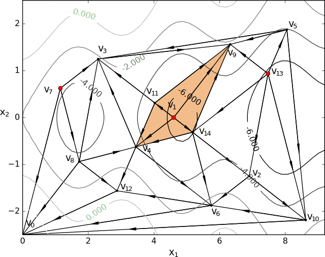
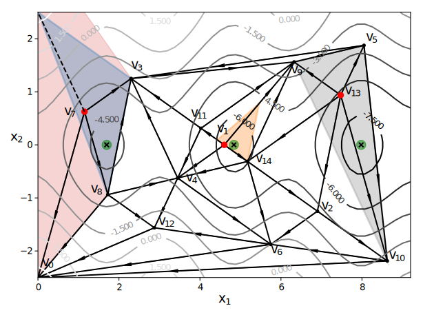
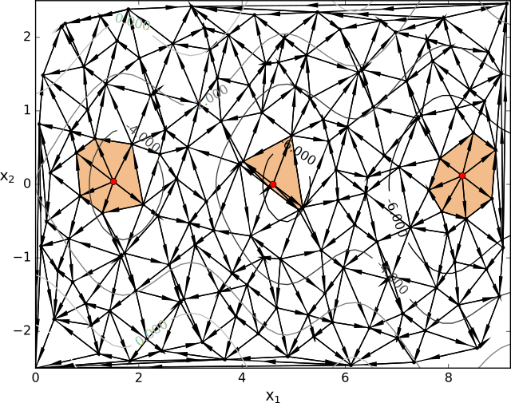
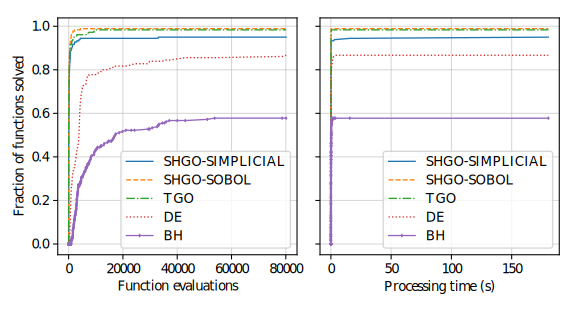
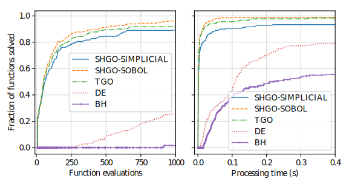

<script type="text/x-mathjax-config"> MathJax.Hub.Config({ TeX: { equationNumbers: { autoNumber: "all" } } }); </script>
<script type="text/x-mathjax-config">
  MathJax.Hub.Config({
    tex2jax: {
      inlineMath: [ ['$','$'], ["\\(","\\)"] ],
      displayMath: [ ['$$','$$'], ["\\[","\\]"] ],
      processEscapes: false
    }
  });
</script>
<script src="https://cdn.mathjax.org/mathjax/latest/MathJax.js?config=TeX-AMS-MML_HTMLorMML" type="text/javascript"></script>

[](https://travis-ci.org/Stefan-Endres/shgo)
[](https://coveralls.io/github/Stefan-Endres/shgo?branch=master)
<sup>*Corresponding author for shgo: [Stefan Endres](https://stefan-endres.github.io/)*<sup>

### Table of Contents
1. **[Introduction](#introduction)**<br>
1. **[Performance summary](#performance-summary)**<br>
    + **[Open-source black-box algorithms](#open-source-black-box-algorithms)**<br>
    + **[Recently published black-box algorithms](#recently-published-black-box-algorithms)**<br>
1. **[Installation](#installation)**<br>
1. **[Examples](#examples)**<br>
    + **[Rosenbrock *unimodal function*](#rosenbrock-unimodal-function)**<br>
        + [Bounded variables](#bounded-variables)
        + [Unbounded variables](#unbounded-variables)
    + **[Eggholder *multimodal function*](#eggholder-multimodal-function)**<br>
        + [Mapping local minima](#mapping-local-minima)
        + [Improving results](#improving-results)
    + **[Cattle feed problem (HS73) with *non-linear constraints*](#cattle-feed-hs73-problem-with-non-linear-constraints)**<br>
1. **[Parameters](#parameters)**<br>
1. **[Returns](#returns)**<br>
1. **[References](#references)**<br>

Introduction
------------

Global optimisation using simplicial homology global optimisation [1]. Appropriate for solving general purpose NLP and blackbox optimisation problems to global optimality (low dimensional problems).

In general, the optimisation problems are of the form::

\begin{eqnarray} \nonumber
  \min_x && f(x),  x \in \mathbb{R}^n \\\\\\ \nonumber
   \text{s.t.} && g_i(x) \ge 0, ~ \forall i = 1,...,m \\\\\\ \nonumber
   && h_j(x) = 0,  ~\forall j = 1,...,p
\end{eqnarray}

where $x$ is a vector of one or more variables.
$f(x)$ is the objective function $f: \mathbb{R}^n \rightarrow \mathbb{R}$

$g_i(x)$ are the inequality constraints $\mathbb{g}: \mathbb{R}^n \rightarrow \mathbb{R}^m$

$h_j(x)$ are the equality constrains $\mathbb{h}: \mathbb{R}^n \rightarrow \mathbb{R}^p$

Optionally, the lower and upper bounds $x_l \le x \le x_u$ for each element in $x$ can also be specified using the `bounds` argument.

While most of the theoretical advantages of shgo are only proven for when $f(x)$ is a Lipschitz smooth function. The algorithm is also proven to converge to the global optimum for the more general case where $f(x)$ is non-continuous, non-convex and non-smooth iff the default sampling method is used [1].

In brief the algorithm utilises concepts from combinatorial integral homology theory to find sub-domains which are, approximately, locally convex and provides characterisations of the objective function. For example on the following objective function surface:



The $k-$chain $C(\mathcal{H}^k), k = n + 1$ of simplices in $\textrm{st}\left( v_1 \right)$ forms a boundary cycle $\partial(C(\mathcal{H}^{n + 1})) = \overline{v_{11} v_{9}} - \overline{v_{9} v_{14}} + \overline{v_{14} v_{4}} - \overline{v_{4} v_{11}}$ with $\partial\left(\partial(C(\mathcal{H}^{n + 1}))\right) = \emptyset$

The starting point $v_1$ and its corresponding constraints are then passed to local-minimisation routines during each iteration. The algorithm provides many additional guarantees such always passing active constraints (in $g_i(x)$) when a local minimum lies on it. For example, here the star domain around vertex $v_7$ is bounded by the global constraints of the problem:




Another important property of shgo is that it is proven that one and only one starting point for every strictly unique minimum is produced. So the number of locally convex subdomains do not increase with increased sampling of the objective function, rather only the constraints of the convex subdomains are refined:



This distinguishes it from many other global optimisation algorithms using graph theory and clustering methods that often show poor performance by producing starting points that converge to the same local minimum [1]. These guarantees are [proven to hold for Lipschitz smooth functions of arbitrarily high dimensions](https://github.com/Stefan-Endres/mdissertation/blob/master/dissertation.pdf). In addition since the locally convex sub-domains are processed, shgo can concentrate on the global search. This circumvents the need to specify the usual trade-off between a local and global search.

The full outline of the algorithm can be downloaded [here](files/algorithm.pdf). Detailed description of the properties and their proofs can be found in [1].

The local search method may be specified using the ``minimizer_kwargs`` parameter which is inputted to ``scipy.optimize.minimize``. By default the ``SLSQP`` method is used. Other local minimisation methods more suited to the problem can also be used. In general it is recommended to use the ``SLSQP`` or ``COBYLA`` local minimization if inequality constraints are defined for the problem since the other methods do not use constraints.

The `sobol` method points are generated using the Sobol [2] sequence. The primitive polynomials and various sets of initial direction numbers for generating Sobol sequences is provided by [3] by Frances Kuo and Stephen Joe. The original program sobol.cc (MIT) is available and described at http://web.maths.unsw.edu.au/~fkuo/sobol/ translated to Python 3 by Carl Sandrock 2016-03-31.

The algorithm is generally applicable to low dimensional black problems ([~10-dimensional problems](https://www.youtube.com/watch?v=fhNuspYbMeI)) unless more information can be supplied to the algorithm. This is not necessarily only gradients and hessians. For example if it is known that the decision variables of the objective function are symmetric, then the ``symmetry`` option can be used in order to solve problems with hundreds of variables.


Performance summary
-----------------
#### Open-source black-box algorithms

The shgo algorithm only makes use of function evaluations without requiring the derivatives of objective functions. This makes it applicable to black-box global optimisation problems. Here we compare the SHGO and TGO algorithms with the SciPy implementations Jones et al. (2001–) of basinhopping (BH) [4-5] and differential evolution (DE) orignally proposed Storn and Price [6]. These algorithms were chosen because the open source versions are readily available in the SciPy project. The test suite contains multi-modal problems with box constraints, they are described in detail in [infinity77.net/global_optimization/](https:infinity77.net/global_optimization/index.html). We used the stopping criteria pe = 0.01% for shgo and tgo. Any local function evaluations were added to the global count. For the stochastic algorithms (BH and DE) the starting points provided by the test suite were used. For every test the algorithm was terminated if the global minimum was not found after 10 minutes of processing time and the test was flagged as a fail.

This figure shows the performance profiles for SHGO, TGO, DE and BH on the SciPy benchmarking test suite using function evaluations and processing run time as performance criteria:



Performance profiles zoomed in to the range of f.e. = [0, 1000] function evaluations and [0, 0.4] seconds run time:



From the figures it can be observed that for this problem set shgo-sobol was the best performing algorithm, followed closely by tgo and shgo-simpl. The zoomed figure provides a clearer comparison between these three algorithms. While the performance of all 3 algorithms are comparable, shgo-Sobol tends to outperform shgo, solving more problems or a given number of function evaluations. This is expected since, for the same sampling point sequence, tgo produced more than one starting point in the same locally convex domain while shgo is guaranteed to only produce one after adequate sampling. While shgo-simpl has the advantage of having the theoretical guarantee of convergence, the sampling sequence has not been optimised yet requiring more function evaluations with every iteration than shgo-sobol.

#### Recently published black-box algorithms

A recent review and experimental comparison of 22 derivative-free optimisation algorithms by Rios and Sahinidis [7] concluded that global optimisation solvers solvers such as TOMLAB/MULTI-MIN, TOMLAB/GLCCLUSTER, MCS and TOMLAB/LGO perform better, on average, than other derivative-free solvers in terms of solution quality within 2500 function evaluations. Both the TOMLAB/GLC-CLUSTER and MCS Huyer and Neumaier (1999) implementations are based on the well-known DIRECT (DIviding RECTangle) algorithm [8].

The DISIMPL (DIviding SIMPLices) algorithm was recently proposed by Paulavičius and Žilinskas [9]. The experimental investigation in [9] shows that the proposed simplicial algorithm gives very competitive results compared to the DIRECT algorithm. DISIMPL has been extended in [10-11]. The Gb-DISIMPL (Globally-biased DISIMPL) was compared in Paulavičius et al. (2014) [10] to the DIRECT and DIRECT-l methods in extensive numerical experiments on 800 multidimensional multiextremal. Gb-DISIMPL was shown to provide highly competative results compared the other algorithms.

More recently the Lc-DISIMPL variant of the algorithm was developed to handle optimisation problems with linear constraints [12]. Below we use an extract of the results with the highest performing Lc-DISIMPL algorithm (Lc-DISIMPL-v) and  DIRECT-L1 with the best performaning parameters (pp = 10). The full table can be found at [here](files/table.pdf). From the table it can be seen shgo provides competative results compared to the other algorithms:


| Algorithm: | shgo-simpl| shgo-sob | Lc-DISIMPL-v  | PSwarm (avg) | DIRECT-L1 |
|------------|---:|-----:|------:|-------------:|----------:|
| horst-1   |  97 |   24 | 7    | 182            |  287$^a$    |
| horst-2   |  10 |   11 | 5    | 176            |  265$^a$    |
| horst-3   |  6  |    7 | 5    | 43             |  5$^a$      |
| horst-4   |  10 |   25 | 8    | 179            |  58293$^a$  |
| horst-5   | 20  | 15   | 8    | 150            |  7$^a$      |
| horst-6   | 22  | 59   | 10   | 172            |  11$^a$     |
| horst-7   | 10  | 15   | 10   | 201            |  7$^a$      |
| hs021     | 24  | 23   | 189  | 110            | 97          |
| hs024     | 24  | 15   | 3    | 153            |  19$^a$     |
| hs035     | 37  | 41   | 630  | 311            |  >100000    |
| hs036     | 105 | 20   | 8    | 179            |  25$^a$     |
| hs037     | 72  | 63   | 186  | 131            |  7$^a$      |
| hs038     | 225 | 1029 | 3379 | 54445          | 7401        |
| hs044     | 199 | 35   | 20   |  218$^{b(9)}$  | 90283       |
| hs076     | 56  | 37   | 548  | 198            | 19135       |
| s224      | 166 | 165  | 49   | 107            |  7$^a$      |
| s231      | 99  | 99   | 2137 | 1011           | 1261        |
| s232      | 24  | 15   | 3    | 144            |  19$^a$     |
| s250      | 105 | 20   | 8    | 296            |  25$^a$     |
| s251      | 72  | 63   | 186  | 84             |  7$^a$      |
| bunnag1   | 34  | 47   | 630  | 142            | 1529        |
| bunnag2   | 46  | 36   | 16   | 153            |  >100000    |
|           |     |      |      |                |             |
| Average   | 66  | 88   | 366  | 2672           |  >17213     |


$a$ result is outside the feasible region

$b(t)$ $t$ out of 10 times the global solution was not reached 

$c$ results produced by Paulavičius & Žilinskas (2016)


Installation
-----------------

Stable:
```
$ pip install shgo
```

Latest:
```
$ git clone https://bitbucket.org/upiamcompthermo/shgo
$ cd shgo
$ python setup.py install
$ python setup.py test
```


Examples
----------

#### Rosenbrock unimodal function

##### Bounded variables

First consider the problem of minimizing the [Rosenbrock function](https://en.wikipedia.org/wiki/Test_functions_for_optimization) which is unimodal in 2-dimensions. This function is implemented in `rosen` in `scipy.optimize`

```python
>>> from scipy.optimize import rosen
>>> from shgo import shgo
>>> bounds = [(0,2), (0, 2)]
>>> result = shgo(rosen, bounds)
>>> result.x, result.fun
(array([ 1.,  1.]), 3.6584112734652932e-19)
```

##### Unbounded variables

Note that bounds determine the dimensionality of the objective function and is therefore a required input, however you can specify empty bounds using ``None`` or objects like ``numpy.inf`` which will be converted to large float numbers.

```python
>>> bounds = [(None, None), ]*2
>>> result = shgo(rosen, bounds)
>>> result.x
array([ 0.99999555,  0.99999111])
```

#### Eggholder multimodal function
##### Mapping local minima

Next we consider the [Eggholder function](https://en.wikipedia.org/wiki/Test_functions_for_optimization), a problem with several local minima and one global minimum. We will demonstrate the use of some of the arguments and capabilities of shgo.

```python
>>> from scipy.optimize import shgo
>>> import numpy as np
>>> def eggholder(x):
...     return (-(x[1] + 47.0)
...             * np.sin(np.sqrt(abs(x[0]/2.0 + (x[1] + 47.0))))
...             - x[0] * np.sin(np.sqrt(abs(x[0] - (x[1] + 47.0))))
...             )
...
>>> bounds = [(-512, 512), (-512, 512)]
```

shgo has two built-in low discrepancy sampling sequences. The default ``simplicial`` and the ``sobol`` sequence. First we will input 30 initial sampling points of the Sobol sequence

```python
>>> result = shgo(eggholder, bounds, n=30, sampling_method='sobol')
>>> result.x, result.fun
(array([ 512.    ,  404.23180542]), -959.64066272085051)
```

``shgo`` also has a return for any other local minima that was found, these  can be called using:

```python
>>> result.xl, result.funl
(array([[ 512.   ,  404.23180542],
   [ 283.07593402, -487.12566542],
   [-294.66820039, -462.01964031],
   [-105.87688985,  423.15324143],
   [-242.97923629,  274.38032063],
   [-506.25823477,    6.3131022 ],
   [-408.71981195, -156.10117154],
   [ 150.23210485,  301.31378508],
   [  91.00922754, -391.28375925],
   [ 202.8966344 , -269.38042147],
   [ 361.66625957, -106.96490692],
   [-219.40615102, -244.06022436],
   [ 151.59603137, -100.61082677]]),
   array([-959.64066272, -718.16745962, -704.80659592, -565.99778097,
   -559.78685655, -557.36868733, -507.87385942, -493.9605115 ,
   -426.48799655, -421.15571437, -419.31194957, -410.98477763,
   -202.53912972]))
   ```

These results are useful in applications where there are many global minima and the values of other global minima are desired or where the local minima can provide insight into the system such as for example morphologies in physical chemistry [13].


##### Improving results

Now suppose we want to find a larger number of local minima (or we hope to find a lower minimum than the current best). This can be accomplished for example by increasing the amount of sampling points or the number of iterations. We'll increase the number of sampling points to 60 and the number of iterations to 3 increased from the default 100 for a total of 60 x 3 = 180 initial sampling points.

```python
>>> result_2 = shgo(eggholder, bounds, n=60, iters=3, sampling_method='sobol')
>>> len(result.xl), len(result_2.xl)
(13, 33)
```

Note that there is a difference between specifying arguments for ex. ``n=180, iters=1`` and ``n=60, iters=3``. In the first case the promising points contained in the minimiser pool is processed only once. In the latter case it is processed every 60 sampling points for a total of 3 iterations.

#### Cattle feed HS73 problem with non-linear constraints

To demonstrate solving problems with non-linear constraints consider the following example from Hock and Schittkowski problem 73 (cattle-feed) [14]::

\begin{eqnarray} \nonumber
  \textrm{minimize}: f(x)  =&& 24.55  x_1 + 26.75  x_2 + 39  x_3 + 40.50  x_4 & \\\\\\ \nonumber
   \text{s.t.} && 2.3 x_1 + 5.6  x_2 + 11.1  x_3 + 1.3  x_4 - 5 &\ge 0, \\\\\\ \nonumber
   && 12 x_1 + 11.9  x_2 + 41.8 x_3 + 52.1 x_4 - 21 & \\\\\\ \nonumber
   && -1.645 \sqrt{0.28 x_1^2 + 0.19 x_2^2 +
                                  20.5 x_3^2 + 0.62  x_4^2} &\ge 0, \\\\\\ \nonumber
&& x_1 + x_2 + x_3 + x_4 - 1 &= 0, \\\\\\ \nonumber
&& 0 \le x_i \le 1 ~~ \forall i
\end{eqnarray}

Approx. answer [4]:
    $f([0.6355216, -0.12e^{-11}, 0.3127019, 0.05177655]) = 29.894378$

```python
    >>> from scipy.optimize import shgo
    >>> import numpy as np
    >>> def f(x):  # (cattle-feed)
    ...     return 24.55*x[0] + 26.75*x[1] + 39*x[2] + 40.50*x[3]
    ...
    >>> def g1(x):
    ...     return 2.3*x[0] + 5.6*x[1] + 11.1*x[2] + 1.3*x[3] - 5  # >=0
    ...
    >>> def g2(x):
    ...     return (12*x[0] + 11.9*x[1] +41.8*x[2] + 52.1*x[3] - 21
    ...             - 1.645 * np.sqrt(0.28*x[0]**2 + 0.19*x[1]**2
    ...                             + 20.5*x[2]**2 + 0.62*x[3]**2)
    ...             ) # >=0
    ...
    >>> def h1(x):
    ...     return x[0] + x[1] + x[2] + x[3] - 1  # == 0
    ...
    >>> cons = ({'type': 'ineq', 'fun': g1},
    ...         {'type': 'ineq', 'fun': g2},
    ...         {'type': 'eq', 'fun': h1})
    >>> bounds = [(0, 1.0),]*4
    >>> res = shgo(f, bounds, iters=2, constraints=cons)
    >>> res
         fun: 29.894378159142136
        funl: array([ 29.89437816])
     message: 'Optimization terminated successfully.'
        nfev: 119
         nit: 2
       nlfev: 40
       nljev: 0
     success: True
           x: array([  6.35521569e-01,   1.13700270e-13,   3.12701881e-01,
             5.17765506e-02])
          xl: array([[  6.35521569e-01,   1.13700270e-13,   3.12701881e-01,
              5.17765506e-02]])
    >>> g1(res.x), g2(res.x), h1(res.x)
    (-5.0626169922907138e-14, -2.9594104944408173e-12, 0.0)
```


Parameters
----------
    func : callable

The objective function to be minimized.  Must be in the form
``f(x, *args)``, where ``x`` is the argument in the form of a 1-D array
and ``args`` is a tuple of any additional fixed parameters needed to
completely specify the function.

---

    bounds : sequence

Bounds for variables.  ``(min, max)`` pairs for each element in ``x``,
defining the lower and upper bounds for the optimizing argument of
`func`. It is required to have ``len(bounds) == len(x)``.
``len(bounds)`` is used to determine the number of parameters in ``x``.
Use ``None`` for one of min or max when there is no bound in that
direction. By default bounds are ``(None, None)``.

---

    args : tuple, optional

Any additional fixed parameters needed to completely specify the
objective function.

---

    constraints : dict or sequence of dict, optional

Constraints definition.
Function(s) $\mathbb{R}^n$ in the form:

$g(x) \le 0$ applied as $g : \mathbb{R}^n -> \mathbb{R}^m$

$h(x) = 0$ applied as $g : \mathbb{R}^n -> \mathbb{R}^p$

Each constraint is defined in a dictionary with fields:

    * type : str
        Constraint type: 'eq' for equality $h(x), 'ineq' for inequality $g(x).
    * fun : callable
        The function defining the constraint.
    * jac : callable, optional
        The Jacobian of `fun` (only for SLSQP).
    * args : sequence, optional
        Extra arguments to be passed to the function and Jacobian.

Equality constraint means that the constraint function result is to
be zero whereas inequality means that it is to be non-negative.
Note that COBYLA only supports inequality constraints.

NOTE:   Only the COBYLA and SLSQP local minimize methods currently
        support constraint arguments. If the ``constraints`` sequence
        used in the local optimization problem is not defined in
        ``minimizer_kwargs`` and a constrained method is used then the
        global ``constraints`` will be used.
        (Defining a ``constraints`` sequence in ``minimizer_kwargs``
        means that ``constraints`` will not be added so if equality
        constraints and so forth need to be added then the inequality
        functions in ``constraints`` need to be added to
        ``minimizer_kwargs`` too).

---

    n : int, optional

Number of sampling points used in the construction of the simplicial complex. Note that this argument is only used for ``sobol`` and other arbitrary sampling_methods.

---

    iters : int, optional

Number of iterations used in the construction of the simplicial complex.

---

    callback : callable, optional

Called after each iteration, as ``callback(xk)``, where ``xk`` is the
current parameter vector.

---

    minimizer_kwargs : dict, optional

Extra keyword arguments to be passed to the minimizer
``scipy.optimize.minimize`` Some important options could be:

    * method : str
        The minimization method (e.g. ``SLSQP``)
    * args : tuple
        Extra arguments passed to the objective function (``func``) and
        its derivatives (Jacobian, Hessian).
    * options : dict, optional
        Note that by default the tolerance is specified as ``{ftol: 1e-12}``

---

    options : dict, optional

A dictionary of solver options. Many of the options specified for the
global routine are also passed to the scipy.optimize.minimize routine.
The options that are also passed to the local routine are marked with an
(L)

Stopping criteria, the algorithm will terminate if any of the specified
criteria are met. However, the default algorithm does not require any to
be specified:

    * maxfev : int (L)
        Maximum number of function evaluations in the feasible domain.
        (Note only methods that support this option will terminate
        the routine at precisely exact specified value. Otherwise the
        criterion will only terminate during a global iteration)
    * f_min
        Specify the minimum objective function value, if it is known.
    * f_tol : float
        Precision goal for the value of f in the stopping
        criterion. Note that the global routine will also
        terminate if a sampling point in the global routine is
        within this tolerance.
    * maxiter : int
        Maximum number of iterations to perform.
    * maxev : int
        Maximum number of sampling evaluations to perform (includes
        searching in infeasible points).
    * maxtime : float
        Maximum processing runtime allowed
    * maxhgrd : int
        Maximum homology group rank differential. The homology group of the
        objective function is calculated (approximately) during every
        iteration. The rank of this group has a one-to-one correspondence
        with the number of locally convex subdomains in the objective
        function (after adequate sampling points each of these subdomains
        contain a unique global minima). If the difference in the hgr is 0
        between iterations for ``maxhgrd`` specified iterations the
        algorithm will terminate.

Objective function knowledge:

    * symmetry : bool
       Specify True if the objective function contains symmetric variables.
       The search space (and therfore performance) is decreased by O(n!).

Algorithm settings:

    * minimize_every_iter : bool
        If True then promising global sampling points will be passed to a
        local minimisation routine every iteration. If False then only the
        final minimiser pool will be run.
    * local_iter : int
        Only evaluate a few of the best minimiser pool candiates every
        iteration. If False all potential points are passed to the local
        minimsation routine.
    * infty_constraints: bool
        If True then any sampling points generated which are outside will
        the feasible domain will be saved and given an objective function
        value of numpy.inf. If False then these points will be discarded.
        Using this functionality could lead to higher performance with
        respect to function evaluations before the global minimum is found,
        specifying False will use less memory at the cost of a slight
        decrease in performance.

Feedback:

    * disp : bool (L)
        Set to True to print convergence messages.

---

    sampling_method : str or function, optional

Current built in sampling method options are ``sobol`` and ``simplicial``. The default ``simplicial`` uses less memory and provides the theoretical guarantee of convergence to the global minimum in finite time. The ``sobol`` method is faster in terms of sampling point generation at the cost of higher memory resources and the loss of guaranteed convergence. It is more appropriate for most "easier" problems where the convergence is relatively fast. User defined sampling functions must accept two arguments of ``n`` sampling points of dimension ``dim`` per call and output an array of s ampling points with shape `n x dim`. See SHGO.sampling_sobol for an example function.


Returns
-------
    res : OptimizeResult

The optimization result represented as a `OptimizeResult` object.
Important attributes are:
    ``x`` the solution array corresponding to the global minimum,
    ``fun`` the function output at the global solution,
    ``xl`` an ordered list of local minima solutions,
    ``funl`` the function output at the corresponding local solutions,
    ``success`` a Boolean flag indicating if the optimizer exited
    successfully,
    ``message`` which describes the cause of the termination,
    ``nfev`` the total number of objective function evaluations including
    the sampling calls,
    ``nlfev`` the total number of objective function evaluations
    culminating from all local search optimisations,
    ``nit`` number of iterations performed by the global routine.


References
----------
1. [Endres, SC (2017) "A simplicial homology algorithm for Lipschitz        optimisation".](https://github.com/Stefan-Endres/mdissertation/blob/master/dissertation.pdf)
2. Sobol, IM (1967) "The distribution of points in a cube and the        approximate evaluation of integrals", USSR Comput. Math. Math. Phys.        7, 86-112.
3. Joe, SW and Kuo, FY (2008) "Constructing Sobol sequences with better two-dimensional projections", SIAM J. Sci. Comput. 30, 2635-2654.
4. Li, Z. and Scheraga, H. A. (1987) “Monte carlo-minimization approach to the multipleminima problem in protein folding”, Proceedings of the National Academy of Sciences, 84 (19), 6611–6615.
5. Wales, D. J. and Doye, J. P. (1997) “Global optimization by basin-hopping and the lowest energy structures of lennard-jones clusters containing up to 110 atoms”, The Journal of Physical Chemistry A, 101 (28), 5111–5116.
6. Storn, R. and Price, K. (1997) “Differential evolution – a simple and efficient heuristic for global optimization over continuous spaces”, Journal of Global Optimization, 11 (4), 341–359 URL http://dx.doi.org/10.1023/A:1008202821328.
7. Rios, L. M. and Sahinidis, N. V. Jul (2013) “Derivative-free optimization: a review of algorithms and comparison of software implementations”, Journal of Global Optimization, 56 (3), 1247–1293.    
8. Jones, D. R.; Perttunen, C. D. and Stuckman, B. E. Oct (1993) “Lipschitzian optimization without the lipschitz constant”, Journal of Optimization theory and Applications,79 (1), 157–181.
9. Paulavičius, R. and Žilinskas, J. May (2014)b “Simplicial lipschitz optimization without the lipschitz constant”, Journal of Global Optimization, 59 (1), 23–40.
10. Paulavičius, R.; Sergeyev, Y. D.; Kvasov, D. E. and Žilinskas, J. Jul (2014) “Globally-biased disimpl algorithm for expensive global optimization”, Journal of Global Optimization, 59 (2), 545–567.
11. Paulavičius, R. and Žilinskas, J. (2014)a Simplicial global optimization, Springer
12. Paulavičius, R. and Žilinskas, J. Feb (2016) “Advantages of simplicial partitioning for lipschitz optimization problems with linear constraints”, Optimization Letters, 10 (2), 237–246.
13.  Wales, DJ (2015) "Perspective: Insight into reaction coordinates and dynamics from the potential energy landscape",        Journal of Chemical Physics, 142(13), 2015.
14. Hoch, W and Schittkowski, K (1981) "Test examples for nonlinear programming codes", Lecture Notes in Economics and mathematical Systems, 187. Springer-Verlag, New York. http://www.ai7.uni-bayreuth.de/test_problem_coll.pdf
