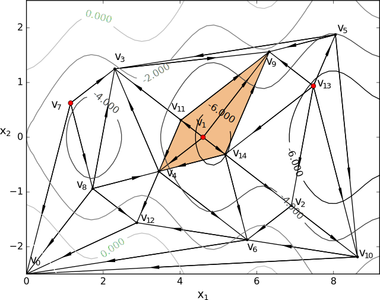
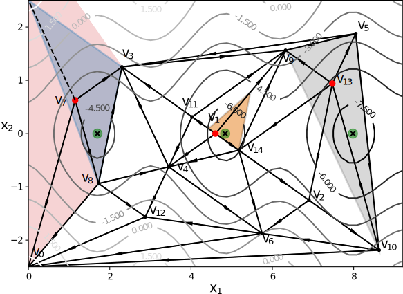
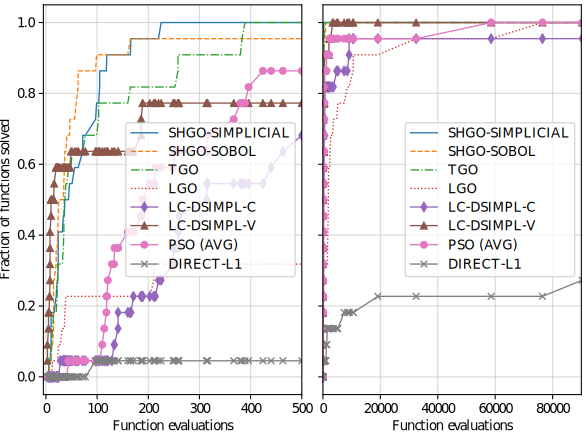

Introduction
============

The simplicial homology global optimisation (shgo) algorithm is a
promising, recently published global optimisation (GO) algorithm
`[1] <#1-endres-sc--sandrock-c-focke-ww-2018-a-simplicial-homology-algorithm-for-lipschitz-optimisation-journal-of-global-optimization>`__.
The software implementation of the algorithm has been shown to be highly
competitive when compared to state of the art commercial and open-source
optimisation software. It was shown that shgo had the highest
performance on a test suite of constrained problems
`[1] <#1-endres-sc--sandrock-c-focke-ww-2018-a-simplicial-homology-algorithm-for-lipschitz-optimisation-journal-of-global-optimization>`__.
The shgo algorithm is relatively unique among GO algorithms in that it
also returns all other local and global minimum in addition to the
global minimum (using novel, rigorously proven methods that detect the
homological properties of the objective function surface). Therefore,
shgo is highly appropriate for problems where the local minima are
desired, such as energy surface problems or problems with more than one
global solution.

As a general purpose solver, shgo solves any general class of
optimisation problem. However, it is most appropriate for solving a
`global and derivative free
optimisation <#global-and-derivative-free-optimisation>`__ problem. It
is simple to use, requiring only a black-box (or “oracle”) function
input. Therefore it is especially appropriate for science and
engineering problems that have embedded simulations or has a highly
complex model structure.

By its nature black-box problems are difficult to solve to global
optimality, therefore it is unlikely that a problem with `more than 10
variables (dimensions) <https://www.youtube.com/watch?v=fhNuspYbMeI>`__
can be solved quickly with the minimum input of the objective function.
If you have more information about your model structure (such as known
bounds, symmetry or gradients) it is generally recommended to `provide
shgo with this information <#Model-structure-and-performance>`__ which
will greatly speed up performance and allow you to solve problems with
more variables.

The remainder of this `introductory <#introduction>`__ section describes
the `theory <simplicial-homology-global-optimisation-theory>`__ behind
shgo and the current `features <summary-of-shgo-features>`__ of the
software. If you want to quickly learn how to implement shgo on a
problem of your own, you can skip to the
`Installation <#installation>`__ section and the `*Non-linear
constraints* <#non-linear-constraints-cattle-feed-problem-hs73>`__
example, which demonstates how to program the most general case of a
global optimisation problem.

Global and Derivative Free Optimisation
---------------------------------------

The shgo algorithm is appropriate for solving general purpose NLP and
blackbox optimisation problems to global optimality (low dimensional
problems)
[`1 <#1-endres-sc--sandrock-c-focke-ww-2018-a-simplicial-homology-algorithm-for-lipschitz-optimisation-journal-of-global-optimization>`__-`2 <(#2-endres-sc-2017-a-simplicial-homology-algorithm-for-lipschitz-optimisation)>`__].
This class of optimisation is also know as CDFO (constrained derivative
free optimisation). In general, the optimisation problems are of the
form::

.. math::

   \begin{eqnarray} \nonumber
   \min_x && f(x),  x \in \mathbb{R}^n \\\\\\ \nonumber
   \text{s.t.} && g_i(x) \ge 0, ~ \forall i = 1,...,m \\\\\\ \nonumber
   && h_j(x) = 0,  ~\forall j = 1,...,p
   \end{eqnarray}

where :math:`x` is a vector of one or more variables. :math:`f(x)` is
the objective function :math:`f: \mathbb{R}^n \rightarrow \mathbb{R}`

:math:`g_i(x)` are the inequality constraints
:math:`\mathbb{g}: \mathbb{R}^n \rightarrow \mathbb{R}^m`

:math:`h_j(x)` are the equality constraints
:math:`\mathbb{h}: \mathbb{R}^n \rightarrow \mathbb{R}^p`

Optionally, the lower and upper bounds :math:`x_l \le x \le x_u` for
each element in :math:`x` can also be specified using the ``bounds``
argument.

While most of the theoretical advantages of shgo are only proven for
when :math:`f(x)` is a Lipschitz smooth function. The algorithm is also
proven to converge to the global optimum for the more general case where
:math:`f(x)` is non-continuous, non-convex and non-smooth iff the
default sampling method is used
`[2] <#2-endres-sc-2017-a-simplicial-homology-algorithm-for-lipschitz-optimisation>`__.

Simplicial Homology Global Optimisation Theory
----------------------------------------------

In order to understand the properties of shgo some background theory is
required. An important facet of shgo} is the concept of homology group
growth which can be used by an optimisation practitioner as a visual
guide of the number of local and global solutions to a problem of
arbitrarily high dimensions. In addition a measure of the mutli-modality
and the geometric sparsity of solutions of the optimisation problem
instance can be deduced.

In brief the algorithm utilises concepts from combinatorial integral
homology theory to find sub-domains which are, approximately, locally
convex and provides characterisations of the objective function as the
algorithm progresses. For example on the following objective function
surface:

   ./image/Fig7.svg

The :math:`k-`\ chain :math:`C(\mathcal{H}^k), k = n + 1` of simplices
in :math:`\textrm{st}\left( v_1 \right)` forms a boundary cycle
:math:`\partial(C(\mathcal{H}^{n + 1})) = \overline{v_{11} v_{9}} - \overline{v_{9} v_{14}} + \overline{v_{14} v_{4}} - \overline{v_{4} v_{11}}`
with
:math:`\partial\left(\partial(C(\mathcal{H}^{n + 1}))\right) = \emptyset`

The starting point :math:`v_1` and its corresponding constraints are
then passed to local-minimisation routines during each iteration. The
algorithm provides many additional guarantees such always passing active
constraints (in :math:`g_i(x)`) when a local minimum lies on it. For
example, here the star domain around vertex :math:`v_7` is bounded by
the global constraints of the problem:

   ./image/Fig8.svg

Another important property of shgo is that it is proven that one and
only one starting point for every strictly unique minimum is produced.
So the number of locally convex subdomains do not increase with
increased sampling of the objective function, rather only the
constraints of the convex subdomains are refined:

.. figure:: ./image/Fig8.svg
   :alt: ./image/Fig8.svg

   ./image/Fig8.svg

This distinguishes it from many other global optimisation algorithms
using graph theory and clustering methods that often show poor
performance by producing starting points that converge to the same local
minimum
[`1 <#1-endres-sc--sandrock-c-focke-ww-2018-a-simplicial-homology-algorithm-for-lipschitz-optimisation-journal-of-global-optimization>`__-`2 <(#2-endres-sc-2017-a-simplicial-homology-algorithm-for-lipschitz-optimisation)>`__].
These guarantees are `proven to hold for Lipschitz smooth functions of
arbitrarily high
dimensions <https://github.com/Stefan-Endres/mdissertation/blob/master/dissertation.pdf>`__.
In addition since the locally convex sub-domains are processed, shgo can
concentrate on the global search. This circumvents the need to specify
the usual trade-off between a local and global search.

This is accomplished in several steps. First the construction of a
simplicial complex :math:`\mathcal{H}` built up from the sampling points
mapped through :math:`f` as vertices following the constructions
described in :raw-latex:`\cite{Endres2018}`. Next a homomorphism is
found between :math:`\mathcal{H}` and :math:`\mathcal{K}`; another
simplicial complex which exists on an abstract constructed surface
:math:`\mathcal{S}`. The :math:`n`-dimensional manifold
:math:`\mathcal{S}` is a connected g sum of g tori
:math:`S := S_0\,\#\,S_1\,\#\,\cdots\,\#\,S_{g - 1}`. The figures below
demonstrate this construction geometrically in the 2-dimensional case.
By using an extension of Brouwer’s fixed point theorem `(Henle,
1979) <#17-henle-m-1979-a-combinatorial-introduction-to-topology-unabriged-dover-1994-republication-of-the-edition-published-by-wh-greeman--company-san-francisco-1979>`__
adapted to handle non-linear constraints, it is proven that each of the
“minimiser points” in the figure below corresponds to a sub-domain
containing a unique local-minima when the problem is adequately sampled.
Through the Invariance Theorem
`[17] <#17-henle-m-1979-a-combinatorial-introduction-to-topology-unabriged-dover-1994-republication-of-the-edition-published-by-wh-greeman--company-san-francisco-1979>`__
and the Eilenberg-Steenrod Axioms
[`17 <#17-henle-m-1979-a-combinatorial-introduction-to-topology-unabriged-dover-1994-republication-of-the-edition-published-by-wh-greeman--company-san-francisco-1979>`__-`18 <#18-eilenberg-s-and-steenrod-n-1952-foundations-of-algebraic-topology-mathematical-reviews-mathscinet-mr14-398b-zentralblatt-math-princeton-47>`__],
we draw another homomorphism between the surfaces of :math:`f` and
:math:`\mathcal{S}`.

   ./image/stori_complete.svg

The process of puncturing a hypersphere at a minimiser point in a
compact search space. Start by identifying a minimiser point in the
:math:`\mathcal{H}^1` (:math:`\cong~\mathcal{K}^1`) graph. By
construction, our initial complex exists on the (hyper-)surface of an
:math:`n`-dimensional torus :math:`\mathcal{S}_0` such that the rest of
:math:`\mathcal{K}^1` is connected and compact. We puncture a
hypersphere at the minimiser point and identify the resulting edges (or
(:math:`n-1`)-simplices in higher dimensional problems). Next we shrink
(a topoligical (ie continuous) transformation) the remainder of the
simplicial complex to the faces and vertices of our (hyper-)plane model.
Make the appropriate identifications for :math:`\mathcal{S}_0` and glue
the identified and connected face :math:`z` (a (:math:`n-1`)-simplex)
that resulted from the hypersphere puncture. The other faces (ie
(:math:`n-1`)-simplices) are connected in the usual way for tori
constructions.

   ./image/stori_sum.svg

The process of puncturing a new hypersphere on $
:raw-latex:`\mathcal{S}`\ *{0},#,:raw-latex:`\mathcal{S}`*\ {1} $ can be
repeated for any new minimiser point without loss of generality
producing
:math:`S := S_0\,\#\,S_1\,\#\,\cdots\,\#\,S_{g - 1} \qquad (g\text{ times})`.

   ./image/non_linear_3.svg

Visual demonstration on surfaces with non-linear constraints, the shaded
region is unfeasible. The vertices of the points mapped to infinity have
undirected edges, therefore they do not form simplicial complexes in the
integral homology. The surfaces of each disconnected simplicial complex
:math:`\mathcal{K}_i` can be constructed from the compact version of the
invariance theorem. The rank of the abelian homology groups
:math:`\mathbf{H}_1(\mathcal{K}_i)` is additive over arbitrary direct
sums.

The full outline of the algorithm can be downloaded
`here <files/algorithm.pdf>`__. Detailed description of the properties
and their proofs can be found in
[`1 <#1-endres-sc--sandrock-c-focke-ww-2018-a-simplicial-homology-algorithm-for-lipschitz-optimisation-journal-of-global-optimization>`__-`2 <(#2-endres-sc-2017-a-simplicial-homology-algorithm-for-lipschitz-optimisation)>`__].

The local search method may be specified using the ``minimizer_kwargs``
parameter which is inputted to ``scipy.optimize.minimize``. By default
the ``SLSQP`` method is used. Other local minimisation methods more
suited to the problem can also be used. In general it is recommended to
use the ``SLSQP`` or ``COBYLA`` local minimization if inequality
constraints are defined for the problem since the other methods do not
use constraints.

The ``sobol`` method points are generated using the Sobol
`[3] <#3-sobol-im-1967-the-distribution-of-points-in-a-cube-and-the-approximate-evaluation-of-integrals-ussr-comput-math-math-phys-7-86-112>`__
sequence. The primitive polynomials and various sets of initial
direction numbers for generating Sobol sequences is provided in
`[4] <#4-joe-sw-and-kuo-fy-2008-constructing-sobol-sequences-with-better-two-dimensional-projections-siam-j-sci-comput-30-2635-2654>`__
by Frances Kuo and Stephen Joe. The original program sobol.cc (MIT) is
available and described at http://web.maths.unsw.edu.au/~fkuo/sobol/
translated to Python 3 by Carl Sandrock 2016-03-31.

The deterministic sampling and refinement of shgo provides a more robust
alternative to other algorithms commonly used in energy optimisation
which rely on random sampling such as monte carlo methods
`[5] <#5-li-z-and-scheraga-h-a-1987-monte-carlo-minimization-approach-to-the-multipleminima-problem-in-protein-folding-proceedings-of-the-national-academy-of-sciences-84-19-66116615>`__
and bashinhopping
`[6] <#6-wales-d-j-and-doye-j-p-1997-global-optimization-by-basin-hopping-and-the-lowest-energy-structures-of-lennard-jones-clusters-containing-up-to-110-atoms-the-journal-of-physical-chemistry-a-101-28-51115116>`__
which can have varying performance.

The algorithm is generally applicable to low dimensional black problems
(`~10-dimensional
problems <https://www.youtube.com/watch?v=fhNuspYbMeI>`__) unless more
information can be supplied to the algorithm. This is not necessarily
only gradients and hessians. For example if it is known that the
decision variables of the objective function are symmetric, then the
``symmetry`` option can be used in order to solve problems with hundreds
of variables.

Summary of shgo features
------------------------

-  **Convergence** to a global minimum assured.
-  Allows for **non-linear constraint** in the problem statement.
-  Extracts **all the minima** in the limit of an adequately sampled
   search space (ie attempts to find all the (quasi-)equilibrium
   solutions).
-  Progress can be tracked after every iteration through the
   **calculated homology groups**.
-  **Competitive performance** compared to state of the art black-box
   solvers.
-  All of the above properties hold for **non-continuous functions with
   non-linear constraints** assuming the search space contains any
   sub-spaces that are continuous and convex.

Performance summary
===================

Open-source black-box algorithms
--------------------------------

The shgo algorithm only makes use of function evaluations without
requiring the derivatives of objective functions. This makes it
applicable to black-box global optimisation problems. Here we compare
the SHGO and TGO algorithms with the SciPy implementation of
basinhopping (BH)
`[6] <#6-wales-d-j-and-doye-j-p-1997-global-optimization-by-basin-hopping-and-the-lowest-energy-structures-of-lennard-jones-clusters-containing-up-to-110-atoms-the-journal-of-physical-chemistry-a-101-28-51115116>`__
and differential evolution (DE) orignally proposed Storn and Price
`[7] <#7-storn-r-and-price-k-1997-differential-evolution--a-simple-and-efficient-heuristic-for-global-optimization-over-continuous-spaces-journal-of-global-optimization-11-4-341359>`__.
These algorithms were chosen because the open source versions are
readily available in the SciPy project. The test suite contains
multi-modal problems with box constraints, they are described in detail
in
`infinity77.net/global_optimization/ <https:infinity77.net/global_optimization/index.html>`__.
We used the stopping criteria pe = 0.01% for shgo and tgo. Any local
function evaluations were added to the global count. For the stochastic
algorithms (BH and DE) the starting points provided by the test suite
were used. For every test the algorithm was terminated if the global
minimum was not found after 10 minutes of processing time and the test
was flagged as a fail.

This figure shows the performance profiles for SHGO, TGO, DE and BH on
the SciPy benchmarking test suite using function evaluations and
processing run time as performance criteria:

.. figure:: ./image/Fig12.svg
   :alt: ./image/Fig12.svg

   ./image/Fig12.svg

Performance profiles zoomed in to the range of f.e. = [0, 1000] function
evaluations and [0, 0.4] seconds run time:

.. figure:: ./image/Fig13.svg
   :alt: ./image/Fig12.svg

   ./image/Fig12.svg

From the figures it can be observed that for this problem set shgo-sobol
was the best performing algorithm, followed closely by tgo and
shgo-simpl. The zoomed figure provides a clearer comparison between
these three algorithms. While the performance of all 3 algorithms are
comparable, shgo-Sobol tends to outperform shgo, solving more problems
or a given number of function evaluations. This is expected since, for
the same sampling point sequence, tgo produced more than one starting
point in the same locally convex domain while shgo is guaranteed to only
produce one after adequate sampling. While shgo-simpl has the advantage
of having the theoretical guarantee of convergence, the sampling
sequence has not been optimised yet requiring more function evaluations
with every iteration than shgo-sobol.

Recently published black-box algorithms
---------------------------------------

A recent review and experimental comparison of 22 derivative-free
optimisation algorithms by Rios and Sahinidis [8] concluded that global
optimisation solvers solvers such as TOMLAB/MULTI-MIN,
TOMLAB/GLCCLUSTER, MCS and TOMLAB/LGO perform better, on average, than
other derivative-free solvers in terms of solution quality within 2500
function evaluations. Both the TOMLAB/GLC-CLUSTER and MCS Huyer and
Neumaier (1999) implementations are based on the well-known DIRECT
(DIviding RECTangle) algorithm [9].

The DISIMPL (DIviding SIMPLices) algorithm was recently proposed by
Paulavičius and Žilinskas [11-13]. The experimental investigation in
[11] shows that the proposed simplicial algorithm gives very competitive
results compared to the DIRECT algorithm [9]. DISIMPL has been extended
in [10-11]. The Gb-DISIMPL (Globally-biased DISIMPL) was compared in
Paulavičius et al. (2014) [11] to the DIRECT and DIRECT-l methods in
extensive numerical experiments on 800 multidimensional multiextremal.
Gb-DISIMPL was shown to provide highly competative results compared the
other algorithms.

More recently the Lc-DISIMPL variant of the algorithm was developed to
handle optimisation problems with linear constraints [13]. Below we use
an extract of the results with the highest performing Lc-DISIMPL
algorithm (Lc-DISIMPL-v) and DIRECT-L1 with the best performaning
parameters (pp = 10). The full table can be found at
`here <files/table.pdf>`__. From the table it can be seen shgo provides
competative results compared to the other algorithms:

+--------+--------+--------+--------+--------+--------+--------+--------+
| Algori | shgo-s | shgo-s | Lc-DIS | PSwarm | LGO    | DIRECT |        |
| thm:   | impl   | ob     | IMPL-v | (avg)  |        | -L1    |        |
+========+========+========+========+========+========+========+========+
| horst- | 97     | 24     | 7      | 1329\  | 2457   | 287\ : |        |
| 1      |        |        |        | :math: |        | math:` |        |
|        |        |        |        | `^{b(3 |        | ^a`    |        |
|        |        |        |        | )}`    |        |        |        |
+--------+--------+--------+--------+--------+--------+--------+--------+
| horst- | 10     | 11     | 5      | 424    | 1645   | 265\ : |        |
| 2      |        |        |        |        |        | math:` |        |
|        |        |        |        |        |        | ^a`    |        |
+--------+--------+--------+--------+--------+--------+--------+--------+
| horst- | 6      | 7      | 5      | 44     | 3649   | 5\ :ma |        |
| 3      |        |        |        |        |        | th:`^a |        |
|        |        |        |        |        |        | `      |        |
+--------+--------+--------+--------+--------+--------+--------+--------+
| horst- | 10     | 25     | 8      | 114    | 39     | 58293\ |        |
| 4      |        |        |        |        |        |  :math |        |
|        |        |        |        |        |        | :`^a`  |        |
+--------+--------+--------+--------+--------+--------+--------+--------+
| horst- | 20     | 15     | 8      | 134    | 37     | 7\ :ma |        |
| 5      |        |        |        |        |        | th:`^a |        |
|        |        |        |        |        |        | `      |        |
+--------+--------+--------+--------+--------+--------+--------+--------+
| horst- | 22     | 59     | 10     | 110    | 8476   | 11\ :m |        |
| 6      |        |        |        |        |        | ath:`^ |        |
|        |        |        |        |        |        | a`     |        |
+--------+--------+--------+--------+--------+--------+--------+--------+
| horst- | 10     | 15     | 10     | 380    | 5217   | 7\ :ma |        |
| 7      |        |        |        |        |        | th:`^a |        |
|        |        |        |        |        |        | `      |        |
+--------+--------+--------+--------+--------+--------+--------+--------+
| hs021  | 24     | 23     | 189    | 189    | 13     | 97     |        |
+--------+--------+--------+--------+--------+--------+--------+--------+
| hs024  | 24     | 15     | 3      | 118    | 1809   | 19\ :m |        |
|        |        |        |        |        |        | ath:`^ |        |
|        |        |        |        |        |        | a`     |        |
+--------+--------+--------+--------+--------+--------+--------+--------+
| hs035  | 37     | 41     | 630    | 316    | 1885   | >10000 |        |
|        |        |        |        |        |        | 0      |        |
+--------+--------+--------+--------+--------+--------+--------+--------+
| hs036  | 105    | 20     | 8      | 396    | 2756   | 25\ :m |        |
|        |        |        |        |        |        | ath:`^ |        |
|        |        |        |        |        |        | a`     |        |
+--------+--------+--------+--------+--------+--------+--------+--------+
| hs037  | 72     | 63     | 186    | 160    | 10516  | 7\ :ma |        |
|        |        |        |        |        |        | th:`^a |        |
|        |        |        |        |        |        | `      |        |
+--------+--------+--------+--------+--------+--------+--------+--------+
| hs038  | 225    | 1029   | 3379   | 58576  | 221    | 7401   |        |
+--------+--------+--------+--------+--------+--------+--------+--------+
| hs044  | 199    | 35     | 20     | 186\ : | 32464  | 90283  |        |
|        |        |        |        | math:` |        |        |        |
|        |        |        |        | ^{b(9) |        |        |        |
|        |        |        |        | }`     |        |        |        |
+--------+--------+--------+--------+--------+--------+--------+--------+
| hs076  | 56     | 37     | 548    | 203    | 221    | 19135  |        |
+--------+--------+--------+--------+--------+--------+--------+--------+
| s224   | 166    | 165    | 49     | 121    | 24     | 7\ :ma |        |
|        |        |        |        |        |        | th:`^a |        |
|        |        |        |        |        |        | `      |        |
+--------+--------+--------+--------+--------+--------+--------+--------+
| s231   | 99     | 99     | 2137   | 2366   | 1996   | 1261   |        |
+--------+--------+--------+--------+--------+--------+--------+--------+
| s232   | 24     | 15     | 3      | 119    | 1826   | 19\ :m |        |
|        |        |        |        |        |        | ath:`^ |        |
|        |        |        |        |        |        | a`     |        |
+--------+--------+--------+--------+--------+--------+--------+--------+
| s250   | 105    | 20     | 8      | 367    | 32     | 25\ :m |        |
|        |        |        |        |        |        | ath:`^ |        |
|        |        |        |        |        |        | a`     |        |
+--------+--------+--------+--------+--------+--------+--------+--------+
| s251   | 72     | 63     | 186    | 129    | 10575  | 7\ :ma |        |
|        |        |        |        |        |        | th:`^a |        |
|        |        |        |        |        |        | `      |        |
+--------+--------+--------+--------+--------+--------+--------+--------+
| bunnag | 34     | 47     | 630    | 214    | 1884   | 1529   |        |
| 1      |        |        |        |        |        |        |        |
+--------+--------+--------+--------+--------+--------+--------+--------+
| bunnag | 46     | 36     | 16     | 252    | 76454  | >10000 |        |
| 2      |        |        |        |        |        | 0      |        |
+--------+--------+--------+--------+--------+--------+--------+--------+
|        |        |        |        |        |        |        |        |
+--------+--------+--------+--------+--------+--------+--------+--------+
| Averag | 66     | 88     | 366    | 3011   | 6841   | >17213 |        |
| e      |        |        |        |        |        |        |        |
+--------+--------+--------+--------+--------+--------+--------+--------+

:math:`a` result is outside the feasible region

:math:`b(t)` :math:`t` out of 10 times the global solution was not
reached

Lc-DISIMPL-v, PSwarm (avg), DIRECT-L1 results produced by Paulavičius &
Žilinskas (2016)

Performance profiles for shgo, TGO, Lc-DISIMPL, LGO, PSwarm and DIRECT-
L1 algorithms on linearly constrained test problems. The figure displays
the fraction test suite problems that can be solved within a given
number of objective function evaluations. The results for Lc-DISIMPL-v,
PSwarm (avg), DIRECT-L1 were produced by

LGO (Lipschitz-continuous Global Optimizer) [14]

J. D. Pintér, Nonlinear optimization with gams /lgo, J. of Global Opti-
mization 38 (1) (2007) 79–101. doi:10.1007/s10898-006-9084-2. URL
http://dx.doi.org/10.1007/s10898-006-9084-2

   ./image/results_add.svg

It can be seen that shgo with the simplicial and Sobol sampling method
generally outperforms every other algorithm. The only exception is the
better early performance by Lc-DISIMPL. This is attributed to
Lc-DISIMPL’s initiation step solving the set of equations in the linear
constraints. In the test problems where the global minimum lie on a
vertex of this convex hull, the algorithm immediately terminates without
a global sampling phase. For more gen- eral, non-linear constraints it
would not be possible to use this feature of Lc-DISIMPL.

Installation
============

Stable:

::

    $ pip install shgo

Latest:

::

    $ git clone https://bitbucket.org/upiamcompthermo/shgo
    $ cd shgo
    $ python setup.py install
    $ python setup.py test

Examples
========

Unimodal function: Rosenbrock
-----------------------------

Bounded variables
~~~~~~~~~~~~~~~~~

First consider the problem of minimizing the `Rosenbrock
function <https://en.wikipedia.org/wiki/Test_functions_for_optimization>`__
which is unimodal in 2-dimensions. This function is implemented in
``rosen`` in ``scipy.optimize``

.. code:: python

    >>> from scipy.optimize import rosen
    >>> from shgo import shgo
    >>> bounds = [(0,2), (0, 2)]
    >>> result = shgo(rosen, bounds)
    >>> result.x, result.fun
    (array([ 1.,  1.]), 3.6584112734652932e-19)

Unbounded variables
~~~~~~~~~~~~~~~~~~~

Note that bounds determine the dimensionality of the objective function
and is therefore a required input, however you can specify empty bounds
using ``None`` or objects like ``numpy.inf`` which will be converted to
large float numbers.

.. code:: python

    >>> bounds = [(None, None), ]*2
    >>> result = shgo(rosen, bounds)
    >>> result.x
    array([ 0.99999555,  0.99999111])

Multimodal function: Eggholder
------------------------------

Mapping local minima
~~~~~~~~~~~~~~~~~~~~

Next we consider the `Eggholder
function <https://en.wikipedia.org/wiki/Test_functions_for_optimization>`__,
a problem with several local minima and one global minimum. We will
demonstrate the use of some of the arguments and capabilities of shgo.

.. code:: python

    >>> from shgo import shgo
    >>> import numpy as np
    >>> def eggholder(x):
    ...     return (-(x[1] + 47.0)
    ...             * np.sin(np.sqrt(abs(x[0]/2.0 + (x[1] + 47.0))))
    ...             - x[0] * np.sin(np.sqrt(abs(x[0] - (x[1] + 47.0))))
    ...             )
    ...
    >>> bounds = [(-512, 512), (-512, 512)]

shgo has two built-in low discrepancy sampling sequences. The default
``simplicial`` and the ``sobol`` sequence. First we will input 30
initial sampling points of the Sobol sequence

.. code:: python

    >>> result = shgo(eggholder, bounds, n=30, sampling_method='sobol')
    >>> result.x, result.fun
    (array([ 512.    ,  404.23180542]), -959.64066272085051)

``shgo`` also has a return for any other local minima that was found,
these can be called using:

.. code:: python

    >>> result.xl, result.funl
    (array([[ 512.   ,  404.23180542],
       [ 283.07593402, -487.12566542],
       [-294.66820039, -462.01964031],
       [-105.87688985,  423.15324143],
       [-242.97923629,  274.38032063],
       [-506.25823477,    6.3131022 ],
       [-408.71981195, -156.10117154],
       [ 150.23210485,  301.31378508],
       [  91.00922754, -391.28375925],
       [ 202.8966344 , -269.38042147],
       [ 361.66625957, -106.96490692],
       [-219.40615102, -244.06022436],
       [ 151.59603137, -100.61082677]]),
       array([-959.64066272, -718.16745962, -704.80659592, -565.99778097,
       -559.78685655, -557.36868733, -507.87385942, -493.9605115 ,
       -426.48799655, -421.15571437, -419.31194957, -410.98477763,
       -202.53912972]))

These results are useful in applications where there are many global
minima and the values of other global minima are desired or where the
local minima can provide insight into the system such as for example
morphologies in physical chemistry [15].

Improving results
~~~~~~~~~~~~~~~~~

Now suppose we want to find a larger number of local minima (or we hope
to find a lower minimum than the current best). This can be accomplished
for example by increasing the amount of sampling points or the number of
iterations. We’ll increase the number of sampling points to 60 and the
number of iterations to 3 increased from the default 100 for a total of
60 x 3 = 180 initial sampling points.

.. code:: python

    >>> result_2 = shgo(eggholder, bounds, n=60, iters=5, sampling_method='sobol')
    >>> len(result.xl), len(result_2.xl)
    (13, 39)

Note that there is a difference between specifying arguments for ex.
``n=180, iters=1`` and ``n=60, iters=3``. In the first case the
promising points contained in the minimiser pool is processed only once.
In the latter case it is processed every 60 sampling points for a total
of 3 iterations.

Non-linear constraints: cattle feed problem (HS73)
--------------------------------------------------

To demonstrate solving problems with non-linear constraints consider the
following example from Hock and Schittkowski problem 73 (cattle-feed)
[16]::

.. raw:: latex

   \begin{eqnarray} \nonumber
     \textrm{minimize}: f(x)  =&& 24.55  x_1 + 26.75  x_2 + 39  x_3 + 40.50  x_4 & \\\\\\ \nonumber
      \text{s.t.} && 2.3 x_1 + 5.6  x_2 + 11.1  x_3 + 1.3  x_4 - 5 &\ge 0, \\\\\\ \nonumber
      && 12 x_1 + 11.9  x_2 + 41.8 x_3 + 52.1 x_4 - 21 & \\\\\\ \nonumber
      && -1.645 \sqrt{0.28 x_1^2 + 0.19 x_2^2 +
                                     20.5 x_3^2 + 0.62  x_4^2} &\ge 0, \\\\\\ \nonumber
   && x_1 + x_2 + x_3 + x_4 - 1 &= 0, \\\\\\ \nonumber
   && 0 \le x_i \le 1 ~~ \forall i
   \end{eqnarray}

Approx. answer [4]:
:math:`f([0.6355216, -0.12e^{-11}, 0.3127019, 0.05177655]) = 29.894378`

.. code:: python

        >>> from shgo import shgo
        >>> import numpy as np
        >>> def f(x):  # (cattle-feed)
        ...     return 24.55*x[0] + 26.75*x[1] + 39*x[2] + 40.50*x[3]
        ...
        >>> def g1(x):
        ...     return 2.3*x[0] + 5.6*x[1] + 11.1*x[2] + 1.3*x[3] - 5  # >=0
        ...
        >>> def g2(x):
        ...     return (12*x[0] + 11.9*x[1] +41.8*x[2] + 52.1*x[3] - 21
        ...             - 1.645 * np.sqrt(0.28*x[0]**2 + 0.19*x[1]**2
        ...                             + 20.5*x[2]**2 + 0.62*x[3]**2)
        ...             ) # >=0
        ...
        >>> def h1(x):
        ...     return x[0] + x[1] + x[2] + x[3] - 1  # == 0
        ...
        >>> cons = ({'type': 'ineq', 'fun': g1},
        ...         {'type': 'ineq', 'fun': g2},
        ...         {'type': 'eq', 'fun': h1})
        >>> bounds = [(0, 1.0),]*4
        >>> res = shgo(f, bounds, iters=3, constraints=cons)
        >>> res
             fun: 29.894378159142136
            funl: array([ 29.89437816])
         message: 'Optimization terminated successfully.'
            nfev: 119
             nit: 3
           nlfev: 40
           nljev: 0
         success: True
               x: array([  6.35521569e-01,   1.13700270e-13,   3.12701881e-01,
                 5.17765506e-02])
              xl: array([[  6.35521569e-01,   1.13700270e-13,   3.12701881e-01,
                  5.17765506e-02]])
        >>> g1(res.x), g2(res.x), h1(res.x)
        (-5.0626169922907138e-14, -2.9594104944408173e-12, 0.0)

Advanced features
=================

(Under construction)

Model structure and performance
-------------------------------

Stopping criteria
-----------------

Parallelization
---------------

Code parameters
===============

Arguments
---------

--------------

func : callable

The objective function to be minimized. Must be in the form
``f(x, *args)``, where ``x`` is the argument in the form of a 1-D array
and ``args`` is a tuple of any additional fixed parameters needed to
completely specify the function.

--------------

::

    bounds : sequence

Bounds for variables. ``(min, max)`` pairs for each element in ``x``,
defining the lower and upper bounds for the optimizing argument of
``func``. It is required to have ``len(bounds) == len(x)``.
``len(bounds)`` is used to determine the number of parameters in ``x``.
Use ``None`` for one of min or max when there is no bound in that
direction. By default bounds are ``(None, None)``.

--------------

::

    args : tuple, optional

Any additional fixed parameters needed to completely specify the
objective function.

--------------

::

    constraints : dict or sequence of dict, optional

Constraints definition. Function(s) :math:`\mathbb{R}^n` in the form:

:math:`g(x) \le 0` applied as
:math:`\mathbb{g}: \mathbb{R}^n \rightarrow \mathbb{R}^m`

:math:`h(x) = 0` applied as
:math:`\mathbb{g}: \mathbb{R}^n \rightarrow \mathbb{R}^p`

Each constraint is defined in a dictionary with fields:

::

    * type : str
        Constraint type: 'eq' for equality $h(x)$, 'ineq' for inequality $g(x)$.
    * fun : callable
        The function defining the constraint.
    * jac : callable, optional
        The Jacobian of `fun` (only for SLSQP).
    * args : sequence, optional
        Extra arguments to be passed to the function and Jacobian.

Equality constraint means that the constraint function result is to be
zero whereas inequality means that it is to be non-negative. Note that
COBYLA only supports inequality constraints.

NOTE: Only the COBYLA and SLSQP local minimize methods currently support
constraint arguments. If the ``constraints`` sequence used in the local
optimization problem is not defined in ``minimizer_kwargs`` and a
constrained method is used then the global ``constraints`` will be used.
(Defining a ``constraints`` sequence in ``minimizer_kwargs`` means that
``constraints`` will not be added so if equality constraints and so
forth need to be added then the inequality functions in ``constraints``
need to be added to ``minimizer_kwargs`` too).

--------------

::

    n : int, optional

Number of sampling points used in the construction of the simplicial
complex. Note that this argument is only used for ``sobol`` and other
arbitrary sampling_methods.

--------------

::

    iters : int, optional

Number of iterations used in the construction of the simplicial complex.

--------------

::

    callback : callable, optional

Called after each iteration, as ``callback(xk)``, where ``xk`` is the
current parameter vector.

--------------

::

    minimizer_kwargs : dict, optional

Extra keyword arguments to be passed to the minimizer
``scipy.optimize.minimize`` Some important options could be:

::

    * method : str
        The minimization method (e.g. ``SLSQP``)
    * args : tuple
        Extra arguments passed to the objective function (``func``) and
        its derivatives (Jacobian, Hessian).
    * options : dict, optional
        Note that by default the tolerance is specified as ``{ftol: 1e-12}``

--------------

::

    options : dict, optional

A dictionary of solver options. Many of the options specified for the
global routine are also passed to the scipy.optimize.minimize routine.
The options that are also passed to the local routine are marked with an
(L)

Stopping criteria, the algorithm will terminate if any of the specified
criteria are met. However, the default algorithm does not require any to
be specified:

::

    * maxfev : int (L)
        Maximum number of function evaluations in the feasible domain.
        (Note only methods that support this option will terminate
        the routine at precisely exact specified value. Otherwise the
        criterion will only terminate during a global iteration)
    * f_min
        Specify the minimum objective function value, if it is known.
    * f_tol : float
        Precision goal for the value of f in the stopping
        criterion. Note that the global routine will also
        terminate if a sampling point in the global routine is
        within this tolerance.
    * maxiter : int
        Maximum number of iterations to perform.
    * maxev : int
        Maximum number of sampling evaluations to perform (includes
        searching in infeasible points).
    * maxtime : float
        Maximum processing runtime allowed
    * minhgrd : int
        Minimum  homology group rank differential. The homology group of the
        objective function is calculated (approximately) during every
        iteration. The rank of this group has a one-to-one correspondence
        with the number of locally convex subdomains in the objective
        function (after adequate sampling points each of these subdomains
        contain a unique global minima). If the difference in the hgr is 0
        between iterations for ``maxhgrd`` specified iterations the
        algorithm will terminate.

Objective function knowledge:

::

    * symmetry : bool
        Specify True if the objective function contains symmetric variables.
        The search space (and therefore performance) is decreased by O(n!).

    * jac : bool or callable, optional
        Jacobian (gradient) of objective function. Only for CG, BFGS,
        Newton-CG, L-BFGS-B, TNC, SLSQP, dogleg, trust-ncg. If jac is a
        Boolean and is True, fun is assumed to return the gradient along
        with the objective function. If False, the gradient will be
        estimated numerically. jac can also be a callable returning the
        gradient of the objective. In this case, it must accept the same
        arguments as fun. (Passed to `scipy.optimize.minmize` automatically)

    * hess, hessp : callable, optional
        Hessian (matrix of second-order derivatives) of objective function
        or Hessian of objective function times an arbitrary vector p.
        Only for Newton-CG, dogleg, trust-ncg. Only one of hessp or hess
        needs to be given. If hess is provided, then hessp will be ignored.
        If neither hess nor hessp is provided, then the Hessian product
        will be approximated using finite differences on jac. hessp must
        compute the Hessian times an arbitrary vector.
        (Passed to `scipy.optimize.minmize` automatically)

Algorithm settings

::

    * minimize_every_iter : bool
        If True then promising global sampling points will be passed to a
        local minimisation routine every iteration. If False then only the
        final minimiser pool will be run. Defaults to False.
    * local_iter : int
        Only evaluate a few of the best minimiser pool candiates every
        iteration. If False all potential points are passed to the local
        minimsation routine.
    * infty_constraints: bool
        If True then any sampling points generated which are outside will
        the feasible domain will be saved and given an objective function
        value of numpy.inf. If False then these points will be discarded.
        Using this functionality could lead to higher performance with
        respect to function evaluations before the global minimum is found,
        specifying False will use less memory at the cost of a slight
        decrease in performance.

Feedback

::

    * disp : bool (L)
        Set to True to print convergence messages.

--------------

::

    sampling_method : str or function, optional

Current built in sampling method options are ``sobol`` and
``simplicial``. The default ``simplicial`` uses less memory and provides
the theoretical guarantee of convergence to the global minimum in finite
time. The ``sobol`` method is faster in terms of sampling point
generation at the cost of higher memory resources and the loss of
guaranteed convergence. It is more appropriate for most “easier”
problems where the convergence is relatively fast. User defined sampling
functions must accept two arguments of ``n`` sampling points of
dimension ``dim`` per call and output an array of s ampling points with
shape ``n x dim``. See SHGO.sampling_sobol for an example function.

Returns
-------

--------------

::

    res : OptimizeResult

The optimization result represented as a ``OptimizeResult`` object.
Important attributes are: ``x`` the solution array corresponding to the
global minimum, ``fun`` the function output at the global solution,
``xl`` an ordered list of local minima solutions, ``funl`` the function
output at the corresponding local solutions, ``success`` a Boolean flag
indicating if the optimizer exited successfully, ``message`` which
describes the cause of the termination, ``nfev`` the total number of
objective function evaluations including the sampling calls, ``nlfev``
the total number of objective function evaluations culminating from all
local search optimisations, ``nit`` number of iterations performed by
the global routine.

References
==========

1.  `Endres, SC, Sandrock, C, Focke, WW (2018) A simplicial homology
    algorithm for lipschitz optimisation, Journal of Global
    Optimization. <http://dx.doi.org/10.1007/s10898-018-0645-y>`__
2.  `Endres, SC (2017) “A simplicial homology algorithm for Lipschitz
    optimisation”. <https://github.com/Stefan-Endres/mdissertation/blob/master/dissertation.pdf>`__
3.  `Sobol, IM (1967) “The distribution of points in a cube and the
    approximate evaluation of integrals”, USSR Comput. Math. Math. Phys.
    7,
    86-112. <http://www.sciencedirect.com/science/article/pii/0041555367901449>`__
4.  `Joe, SW and Kuo, FY (2008) “Constructing Sobol sequences with
    better two-dimensional projections”, SIAM J. Sci. Comput. 30,
    2635-2654. <http://epubs.siam.org/doi/abs/10.1137/070709359?journalCode=sjoce3>`__
5.  `Li, Z. and Scheraga, H. A. (1987) “Monte carlo-minimization
    approach to the multipleminima problem in protein folding”,
    Proceedings of the National Academy of Sciences, 84 (19),
    6611–6615. <https://www.ncbi.nlm.nih.gov/pmc/articles/PMC299132/>`__
6.  `Wales, D. J. and Doye, J. P. (1997) “Global optimization by
    basin-hopping and the lowest energy structures of lennard-jones
    clusters containing up to 110 atoms”, The Journal of Physical
    Chemistry A, 101 (28),
    5111–5116. <http://pubs.acs.org/doi/abs/10.1021/jp970984n>`__
7.  `Storn, R. and Price, K. (1997) “Differential evolution – a simple
    and efficient heuristic for global optimization over continuous
    spaces”, Journal of Global Optimization, 11 (4),
    341–359 <http://dx.doi.org/10.1023/A:1008202821328>`__
8.  `Rios, L. M. and Sahinidis, N. V. Jul (2013) “Derivative-free
    optimization: a review of algorithms and comparison of software
    implementations”, Journal of Global Optimization, 56 (3),
    1247–1293. <https://link.springer.com/article/10.1007/s10898-012-9951-y>`__
9.  `Jones, D. R.; Perttunen, C. D. and Stuckman, B. E. Oct (1993)
    “Lipschitzian optimization without the lipschitz constant”, Journal
    of Optimization theory and Applications,79 (1),
    157–181. <https://link.springer.com/article/10.1007/BF00941892>`__
10. `Paulavičius, R. and Žilinskas, J. May (2014)b “Simplicial lipschitz
    optimization without the lipschitz constant”, Journal of Global
    Optimization, 59 (1),
    23–40. <https://link.springer.com/article/10.1007/s10898-013-0089-3>`__
11. `Paulavičius, R.; Sergeyev, Y. D.; Kvasov, D. E. and Žilinskas, J.
    Jul (2014) “Globally-biased disimpl algorithm for expensive global
    optimization”, Journal of Global Optimization, 59 (2),
    545–567. <https://link.springer.com/article/10.1007/s10898-014-0180-4>`__
12. `Paulavičius, R. and Žilinskas, J. (2014)a Simplicial global
    optimization,
    Springer <http://www.springer.com/us/book/9781461490920>`__
13. `Paulavičius, R. and Žilinskas, J. Feb (2016) “Advantages of
    simplicial partitioning for lipschitz optimization problems with
    linear constraints”, Optimization Letters, 10 (2),
    237–246. <https://link.springer.com/article/10.1007/s11590-014-0772-4>`__
14. `J. D. Pintér, Nonlinear optimization with gams /lgo, J. of Global
    Optimization 38 (1) (2007)
    79–101. <http://dx.doi.org/10.1007/s10898-006-9084-2>`__
15. `Wales, DJ (2015) “Perspective: Insight into reaction coordinates
    and dynamics from the potential energy landscape”, Journal of
    Chemical Physics, 142(13),
    2015. <http://dx.doi.org/10.1063/1.4916307>`__
16. `Hoch, W and Schittkowski, K (1981) “Test examples for nonlinear
    programming codes”, Lecture Notes in Economics and mathematical
    Systems, 187. Springer-Verlag, New
    York. <http://www.ai7.uni-bayreuth.de/test_problem_coll.pdf>`__
17. Henle, M. (1979) A Combinatorial Introduction to Topology, Unabriged
    Dover (1994) republication of the edition published by WH Greeman &
    Company, San Francisco, 1979
18. Eilenberg, S. and Steenrod, N. (1952) “Foundations of algebraic
    topology”, Mathematical Reviews (MathSciNet): MR14: 398b
    Zentralblatt MATH, Princeton, 47.
